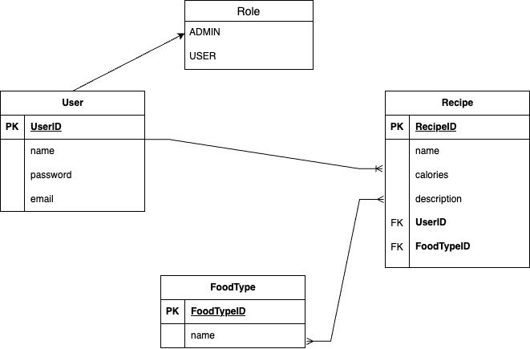

# Recipe Book Web Based Project

## Overview

The Recipe Book App is a digital platform where users can store and share their favorite recipes. This full-stack web application is built using Angular for the frontend and Java Spring Boot for the backend, providing a seamless experience for recipe enthusiasts to manage and discover new culinary delights.

## Class Diagram


## Front-end Part
https://github.com/mohammedaladhary/Recipe-Book-FE.git

## Features
- **User Authentication:**
  - Sign up, log in, and log out functionality.
  - Secure routes for authenticated users.

- **Recipe Management:**
  - Add, edit, and delete recipes.

- **Recipe Exploration:**
  - View a list of all recipes.
  - Get all recipes by foodTypeId.

## Technologies Used
- **Frontend:**
  - Angular
  - HTML, CSS, TypeScript

- **Backend:**
  - Java Spring Boot
  - Spring Security for authentication

- **Database:**
  - MYSQLWorkbench for storing user, recipe and foodType data.

- **Testing:**
  - JUnit for backend testing
  - Implemented authentication and authorization.

## Future Work
1. **User Profile Management:** Implement a user profile page where users can view and update their information. Allow users to change their passwords securely.

2. **Recipe Images:** Allow users to upload images for their recipes. Implement image storage and retrieval for recipe details.

3. **Microservices Architecture:** Refactor the backend to a microservices architecture for better scalability and maintainability. Implement individual services for users, recipes, food types, etc.

## Getting Started
To run this project locally, follow these steps:

1. Clone the repository:

   ```bash
   git clone https://github.com/your-username/recipe-book-app.git
   ```

2. Navigate to the project directory:

   ```bash
   cd recipe-book-app
   ```

3. Install dependencies for the frontend and backend:

   ```bash
   # Frontend
   cd frontend
   npm install

   # Backend
   cd ../backend
   ./mvnw clean install
   ```

4. Start the frontend and backend servers:

   ```bash
   # Frontend
   cd frontend
   ng serve

   # Backend
   cd ../backend
   ./mvnw spring-boot:run
   ```

5. Set up your MySQL database and update the `application.properties` file with your database credentials:
   
   ```
    spring.datasource.url=jdbc:mysql://localhost:3306/db_fp_recipeBook
    spring.datasource.username=root
    spring.datasource.password=(your password)
    spring.datasource.driver-class-name=com.mysql.cj.jdbc.Driver
    spring.jpa.hibernate.ddl-auto=update
    spring.jpa.show-sql=true
    server.error.include-stacktrace=never
    server.port=5005
   ```
   
6. Open your browser and go to [http://localhost:4200](http://localhost:4200) to view the app.

## API Endpoints
> **Note**
> Don't forget to import the postman api end-points file from the project

### Authentication
- `POST /auth/signup`: Register a new user.
- `POST /auth/signin`: Login an existing user.
- `GET /auth/users`: Show Users.
- `GET /auth/admin/welcome`: Show welcome message and given acces to the admin only.

### Recipes
- `POST /auth/recipes/new`: Add new recipe.
- `GET /auth/recipes`: Show Recipes.
- `DELETE /auth/recipes/delete/:recipeId`: Delete a recipe by its id.
- `PUT /auth/recipes/update/:recipeId`: Update a recipe's details.
- `PATCH /auth/recipes/custom-update/:recipeId`: Update a specific field of the recipe's details.For example: "newRecipeName": "Rice".

### FoodTypes
- `POST /auth/foodtype/new`: Add new foodType.
- `GET /auth/foodtype`: Show All FoodTypes.
- `DELETE /auth/foodtype/delete/:foodTypeId`: Delete FoodType.
- `PATCH /auth/foodtype/update/:foodTypeId`: Update a specific field of the foodType's details..
- `GET /auth/foodtype/:foodTypeId/recipes`: Show Recipes by FoodType.

## Extra Links
- [Trello Board](https://trello.com/b/j5eIwwAo/recipe-book)
- [Presentation](https://1drv.ms/p/s!Aku623t0DqxCt1nf1D3NlLBxJeKa?e=dcoubo)
